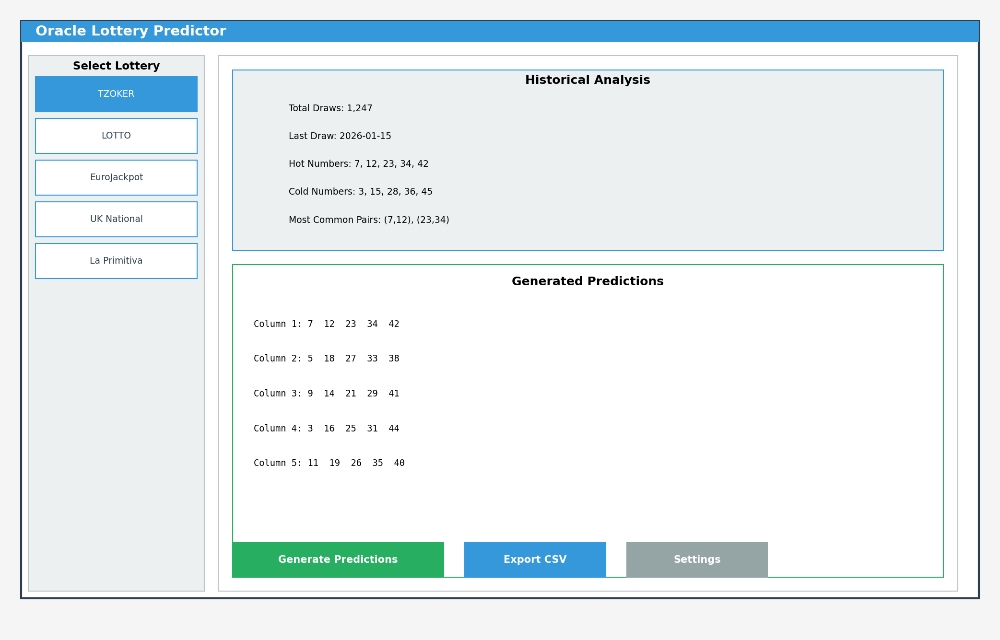

# Υπέρτατος Βοηθός Λαχείων (Oracle Lottery Predictor)
[English](README.md) | [Ελληνικά](README.el.md)

[](https://github.com/Tsoympet/ultra-lottery-helper/actions/workflows/ci.yaml)
[](https://github.com/Tsoympet/ultra-lottery-helper/actions/workflows/build-sign-release.yml)
[](#)
[](#)

Ο **Υπέρτατος Βοηθός Λαχείων** είναι ένα εργαλείο **offline-first** για ανάλυση και παραγωγή στηλών για **ΤΖΟΚΕΡ / ΛΟΤΤΟ / EuroJackpot**.  
Συνδυάζει **EWMA/BMA**, προσαρμοσμένα **luck/unluck**, έξυπνους **περιορισμούς**, δειγματοληψία **Gumbel Top-k**, επιλογή χαρτοφυλακίου **DPP**, ανάλυση ρίσκου με **Monte Carlo**, καθώς και προαιρετικά μοντέλα **ML** (Prophet, LightGBM, Random Forest, XGBoost, SVM).  
Η εφαρμογή παρέχεται ως **native desktop app (PySide6)**, χωρίς browser ή server στο παρασκήνιο.

> Η τυχαιότητα είναι θάλασσα· εμείς χαράσσουμε τα κύματα. Παίξτε υπεύθυνα.

---



## Χαρακτηριστικά

- Offline by default; optional online fetch
- Auto-merge histories from `data/history/<game>/` (CSV/XLS/XLSX)
- Diagnostics: frequency, recency, last-digits, pairs heatmap, odd/even
- Modeling: EWMA, BMA, adaptive luck/unluck, optional ML
- Constraints: sums, odd/even, lows, consecutive, last-digit caps (adaptive/manual)
- Sampler: Gumbel Top-k (+ optional wheels)
- Portfolio: DPP/Greedy + coverage boost; **Monte Carlo** risk
- Optional **EV re-rank** (cost-aware)
- Exports CSV/PNG to `exports/<game>/`
- **Plot caching** & **debounced** heavy sliders
- Windows **Installer** (icon, shortcuts, **Uninstall**)
- CI/CD: GitHub Actions (portable EXE + Installer)

## Quick Start
### Windows (Installer)
1. Download `OracleLotteryPredictorInstaller_X.Y.Z.exe` from **Releases**.
2. Run installer β†’ Start Menu/Desktop shortcuts are created; app data folders (`data/history/*`, `exports/*`) are set up.
3. Launch **Oracle Lottery Predictor (Desktop)** from Start Menu or Desktop. (No browser needed.)

### Portable
- Download `ultra_lottery_helper.exe`, optionally place a `data/` folder next to it, then double-click to run.

### Dev (Python)
```bash
python -m venv .venv
# Windows
.venv\Scripts\activate
# Linux/Mac
source .venv/bin/activate

pip install -r requirements.txt
python src/ulh_desktop.py
```

## Data Layout
```
data/history/{tzoker,lotto,eurojackpot}
exports/{tzoker,lotto,eurojackpot}
assets/icon.ico
```

## Local Build (Windows)
Run:
```
build_installer.bat
```
Produces:
- `dist\ultra_lottery_helper.exe` (portable)
- `dist_installer\OracleLotteryPredictorInstaller_*.exe`

## CI/CD
- `.github/workflows/ci.yml` β€” CI on Linux: installs deps, headless-safe imports (Qt offscreen), optional pytest
- `.github/workflows/build-windows-installer.yml` β€” Windows build:
  - PyInstaller (**desktop entry:** `src/ulh_desktop.py`, bundles `assets`)
  - Inno Setup via Chocolatey
  - Stamps version from release tag (`vX.Y.Z`)
  - Builds installer, computes **SHA256**, uploads artifacts, auto-attaches to Release

## Requirements
- Windows 10/11 for the packaged EXE/installer
- Python 3.10+ (for dev runs)
- Optional ML libraries (enabled automatically if installed): scikit-learn, lightgbm, xgboost, prophet

## License
MIT (see `LICENSE.txt`). Use responsibly; no guarantees.
