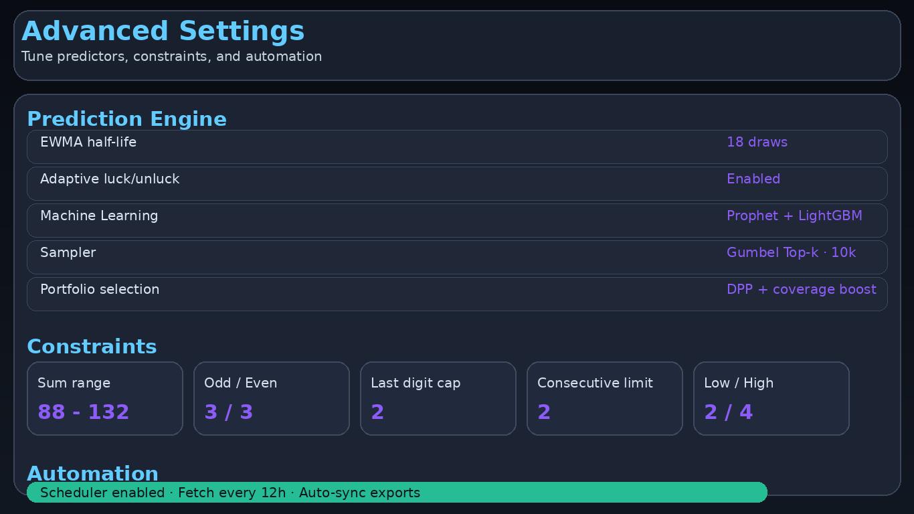
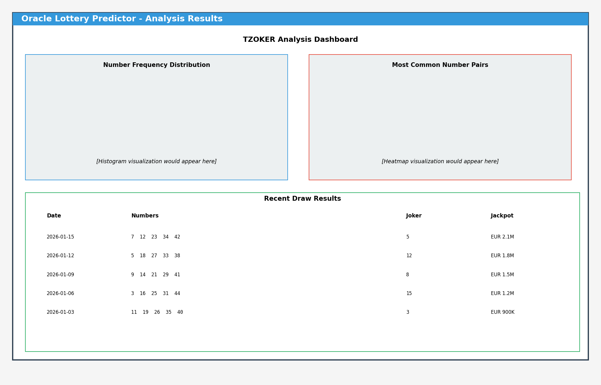

<div align="center">

# πŸ"Š Oracle Lottery Predictor

### Professional Lottery Analysis & Prediction Platform

[](https://github.com/Tsoympet/ultra-lottery-helper/actions/workflows/ci.yaml)
[](https://github.com/Tsoympet/ultra-lottery-helper/actions/workflows/build-sign-release.yml)
[](https://github.com/Tsoympet/ultra-lottery-helper/actions/workflows/build-windows-installer.yaml)
[](https://github.com/Tsoympet/ultra-lottery-helper/actions/workflows/release-checklist.yml)
[](https://github.com/Tsoympet/ultra-lottery-helper/actions/workflows/run-lottery.yml)
[](https://github.com/Tsoympet/ultra-lottery-helper/actions/workflows/dependency-scan.yml)
[](#)
[](#)

[English](README.md) | [Ελληνικά](README.el.md)

**Advanced statistical analysis and intelligent prediction system for multiple international lotteries**

</div>

---


## πŸ"Œ Overview

**Oracle Lottery Predictor** is a professional-grade, offline-first lottery analysis platform that combines advanced statistical modeling with machine learning to generate intelligent predictions. Built as a native desktop application, it offers sophisticated analysis tools without requiring an internet connection or browser.

### Key Technologies
- **Statistical Models**: EWMA, BMA, Adaptive Luck/Unluck Factors
- **Machine Learning**: Prophet, LightGBM, Random Forest, XGBoost, SVM
- **Sampling**: Gumbel Top-k with constraint validation
- **Portfolio Optimization**: DPP (Determinantal Point Process)
- **Risk Analysis**: Monte Carlo simulation
- **Platform**: Native desktop app (PySide6/Qt6)

> **Disclaimer**: Lottery draws are random events. This tool provides statistical analysis and probabilistic predictions. No system can guarantee wins. Play responsibly.

---

## πŸ–₯️ Application Screenshots

### Main Interface
The intuitive desktop application provides easy access to all lottery games and prediction features.


### Advanced Settings & Configuration
Customize prediction algorithms, constraints, and analysis parameters to suit your preferences.



### Comprehensive Analysis Dashboard
View historical data, frequency distributions, number pair analysis, and recent draw results.



---

## 🌍 Supported Lotteries

### πŸ‡¬πŸ‡· Greece
- **TZOKER** - 5 numbers (1-45) + 1 Joker (1-20)
- **LOTTO** - 6 numbers (1-49)

### πŸ‡ͺπŸ‡Ί Pan-European
- **EuroJackpot** - 5 numbers (1-50) + 2 Euro numbers (1-12)

### πŸ‡¬πŸ‡§ United Kingdom
- **UK National Lottery** - 6 numbers (1-59)

### πŸ‡ͺπŸ‡Έ Spain
- **La Primitiva** - 6 numbers (1-49) + 1 reintegro (1-10)

### πŸ‡?πŸ‡Ή Italy
- **SuperEnalotto** - 6 numbers (1-90)

### πŸ‡«πŸ‡· France
- **Loto** - 5 numbers (1-49) + 1 Chance (1-10)

### πŸ‡©πŸ‡ͺ Germany
- **Lotto 6aus49** - 6 numbers (1-49) + 1 Superzahl (1-10)

### πŸ‡¦πŸ‡Ή Austria
- **Austrian Lotto** - 6 numbers (1-45)

### πŸ‡¨πŸ‡­ Switzerland
- **Swiss Lotto** - 6 numbers (1-42) + 1 Lucky number (1-6)

**Note**: All supported lotteries offer progressive jackpots. See [LOTTERY_RESULTS_SOURCES.md](docs/LOTTERY_RESULTS_SOURCES.md) for official results URLs and detailed information.

---

## ✨ Features

### Core Analysis
- **Offline-First Design** - Works without internet connection
- **Automated Data Management** - Auto-merge historical data from CSV/XLS/XLSX files
- **Advanced Diagnostics** - Frequency analysis, recency tracking, last-digit patterns, pair heatmaps, odd/even distribution

### Prediction Engine
- **Statistical Modeling** - EWMA, BMA, adaptive luck/unluck factors
- **Machine Learning** - Optional ML ensemble (Prophet, LightGBM, XGBoost, Random Forest, SVM)
- **Deep Learning** - Lightweight LSTM sequence predictors, Transformer-style attention blocks, neural network ensembles
- **Smart Constraints** - Customizable sum ranges, odd/even balance, consecutive number limits
- **Advanced Sampling** - Gumbel Top-k sampler with optional wheel systems
- **Portfolio Optimization** - DPP/Greedy selection with coverage boost
- **Risk Assessment** - Monte Carlo simulation
- **EV Re-ranking** - Cost-aware expected value optimization

### Advanced Learning & Evaluation
- **Reinforcement Learning** - Reward-driven tuning from observed outcomes
- **Multi-Armed Bandits** - Strategy selection with ε-greedy exploration
- **Genetic Algorithms** - Parameter search with mutation and crossover
- **Cross-Validation & Backtesting** - Walk-forward evaluation on historical data
- **Statistical Significance Testing** - Two-proportion z-tests for strategy changes

### User Insights
- **Confidence Scores** - Softmax-normalized prediction probabilities
- **Explainable AI** - Correlation-based feature importance for transparency
- **Performance Visualization** - Lightweight series outputs for plotting curves
- **A/B Testing Support** - Lift calculations and significance for strategy experiments

### Automation & Tracking
- **βœ¨ AI Learning System** - Adaptive machine learning that improves predictions over time ([AI_SYSTEM_STATUS.md](docs/AI_SYSTEM_STATUS.md))
- **βœ¨ Live Data Feeds** - Automated fetching and storage of latest draw results ([DATA_FETCHER_README.md](docs/DATA_FETCHER_README.md))
- **βœ¨ Intelligent Scheduling** - Configurable periodic data fetching ([SCHEDULER_README.md](docs/SCHEDULER_README.md))
- **βœ¨ Prediction Tracking** - Save predictions, compare with results, track accuracy over time ([PREDICTION_TRACKER_README.md](docs/PREDICTION_TRACKER_README.md))

### Performance & Deployment
- **Plot Caching** - Optimized visualization rendering
- **Debounced Controls** - Smooth slider interaction
- **Windows Installer** - Professional installation with shortcuts and uninstaller
- **CI/CD Pipeline** - Automated builds via GitHub Actions
- **Docker Support** - Containerized deployment ([DOCKER_CMAKE_README.md](DOCKER_CMAKE_README.md))
- **CMake Build System** - Cross-platform build support ([DOCKER_CMAKE_README.md](DOCKER_CMAKE_README.md))

### Export & Reporting
- **Multiple Formats** - Export predictions to CSV and PNG
- **Organized Output** - Game-specific export directories

---

## πŸš€ Quick Start

### Windows (Recommended)

#### Option 1: Installer
1. Download `OracleLotteryPredictorInstaller_X.Y.Z.exe` from [Releases](https://github.com/Tsoympet/ultra-lottery-helper/releases)
2. Run the installer - it will create Start Menu and Desktop shortcuts
3. Launch **Oracle Lottery Predictor** from the Start Menu or Desktop
4. No browser or additional setup required!

#### Option 2: Portable Executable
1. Download `ultra_lottery_helper.exe` from [Releases](https://github.com/Tsoympet/ultra-lottery-helper/releases)
2. Optionally place a `data/` folder next to it for historical data
3. Double-click to run

### Developer Setup

For detailed development instructions, see [SETUP.md](docs/SETUP.md).

**Quick Start:**
```bash
# Create virtual environment
python -m venv .venv

# Activate (Windows)
.venv\Scripts\activate

# Activate (Linux/Mac)
source .venv/bin/activate

# Install dependencies
pip install --upgrade pip
pip install -e .

# Run application
oracle-lottery
# Or
python src/ulh_desktop.py
```

### Docker Deployment

Run the application in a containerized environment:

```bash
# Build and run with Docker
docker build -t oracle-lottery-predictor .
docker run --rm -v $(pwd)/data:/app/data -v $(pwd)/exports:/app/exports \
  oracle-lottery-predictor python src/ulh_desktop.py

# Or use Docker Compose
docker-compose up oracle-lottery

# For detailed Docker and CMake instructions, see docs/DOCKER_CMAKE_README.md
```

### Web Dashboard, Metrics, and Notifications

Run the lightweight web UI (no extra dependencies) for configuration, real-time status, basic metrics, and test email/SMS logging:

```bash
# From repository root (defaults to localhost binding for safety)
python -m src.web_dashboard --port 8080
# Expose externally if needed:
python -m src.web_dashboard --host 0.0.0.0 --port 8080
# Start without binding to the scheduler (status only):
python -m src.web_dashboard --no-scheduler
```

* Features: live status polling, scheduler config edits, metrics view, test alerts.
* Metrics and notification logs are persisted under `data/`.

For cloud deployments with auto-scaling, apply the provided Kubernetes template:

```bash
kubectl apply -f deploy/cloud/kubernetes.yaml
```

The manifest includes a Service for the dashboard and a HorizontalPodAutoscaler (HPA) targeting 70% CPU utilization.

---

## πŸ€– Advanced Features

### Automated Data Fetching

Keep your lottery data up-to-date automatically:

```bash
# Fetch latest draw results for all lotteries
python src/lottery_data_fetcher.py --all

# Fetch specific lottery
python src/lottery_data_fetcher.py --game EUROJACKPOT

# Check fetch status
python src/lottery_data_fetcher.py --status
```

For complete documentation, see [DATA_FETCHER_README.md](docs/DATA_FETCHER_README.md).

### Automated Scheduling

Set up periodic data fetching:

```bash
# Enable automated fetching for all lotteries (every 12 hours)
python src/lottery_scheduler.py --enable-all

# Start the scheduler (runs continuously)
python src/lottery_scheduler.py --start

# Check scheduler status
python src/lottery_scheduler.py --status
```

For complete documentation, see [SCHEDULER_README.md](docs/SCHEDULER_README.md).

### Prediction Tracking

Save and track your predictions:

```bash
# Save a prediction for upcoming draw
python src/prediction_tracker.py --save EUROJACKPOT \
    --numbers "5,12,18,27,33,2,8" \
    --draw-date "2026-01-25"

# Compare predictions with actual results
python src/prediction_tracker.py --compare EUROJACKPOT \
    --draw-date "2026-01-25" \
    --actual "5,12,19,27,33,2,9"

# Auto-compare all pending predictions
python src/prediction_tracker.py --auto-compare

# View accuracy statistics
python src/prediction_tracker.py --stats

# View pending predictions
python src/prediction_tracker.py --pending
```

For complete documentation, see [PREDICTION_TRACKER_README.md](docs/PREDICTION_TRACKER_README.md).

### AI Learning System

The adaptive learning system improves over time:

```bash
# Record predictions for learning
python src/ulh_learn_cli.py record-portfolio TZOKER "1 5 12 27 38" "3 14 22 33 41"

# Record actual draw outcome
python src/ulh_learn_cli.py record-outcome TZOKER --main "3 14 22 33 41" --sec "5"

# Trigger learning and parameter optimization
python src/ulh_learn_cli.py learn TZOKER --k 100 --replay 2
```

The AI system automatically adapts:
- Ensemble weights (EWMA, recency, ML)
- Luck/unluck factors
- Memory half-life
- Based on actual prediction performance

For complete documentation, see [AI_SYSTEM_STATUS.md](docs/AI_SYSTEM_STATUS.md).

---

## πŸ"‚ Data Structure

```
data/
└── history/
    β"œβ"€β"€ tzoker/
    β"œβ"€β"€ lotto/
    β"œβ"€β"€ eurojackpot/
    β"œβ"€β"€ uk_national_lottery/
    β"œβ"€β"€ la_primitiva/
    β"œβ"€β"€ superenalotto/
    β"œβ"€β"€ loto_france/
    β"œβ"€β"€ lotto_6aus49/
    β"œβ"€β"€ austrian_lotto/
    └── swiss_lotto/

exports/
└── [same structure as data/history/]

assets/
β"œβ"€β"€ flags/              # Country flags for each lottery
β"œβ"€β"€ lottery_icons/      # Official lottery icons
β"œβ"€β"€ icon.ico            # Main application icon
β"œβ"€β"€ banner.bmp          # Installer banner
└── splash.png          # Splash screen
```

---

## πŸ"§ Building from Source

### Windows

Run the build script:
```bash
build_installer.bat
```

This produces:
- `dist\ultra_lottery_helper.exe` (portable executable)
- `dist_installer\OracleLotteryPredictorInstaller_*.exe` (installer)

### CI/CD Pipeline

The project includes automated build pipelines:

- **`.github/workflows/ci.yml`** - Cross-platform CI testing
  - Tests on Ubuntu, Windows, and macOS
  - Multiple Python versions (3.9, 3.10, 3.11, 3.12)
  - Headless Qt support for automated testing

- **`.github/workflows/build-windows-installer.yml`** - Windows builds
  - PyInstaller bundling with `src/ulh_desktop.py` entry point
  - Inno Setup installer creation
  - Automatic version stamping from release tags
  - SHA256 checksum generation
  - Automated artifact upload to releases

---

## πŸ"‹ Requirements

### For End Users
- Windows 10/11 (for packaged EXE/installer)
- No additional software required

### For Developers
- Python 3.10 or higher
- Optional ML libraries (auto-enabled if installed):
  - scikit-learn
  - lightgbm
  - xgboost
  - prophet

---

## πŸ"š Documentation

- [SETUP.md](docs/SETUP.md) - Detailed development setup instructions
- [CHANGELOG.md](docs/CHANGELOG.md) - Version history and changes
- [DATA_FETCHER_README.md](docs/DATA_FETCHER_README.md) - Automated data fetching guide
- [SCHEDULER_README.md](docs/SCHEDULER_README.md) - Scheduling system documentation
- [PREDICTION_TRACKER_README.md](docs/PREDICTION_TRACKER_README.md) - Prediction tracking guide
- [AI_SYSTEM_STATUS.md](docs/AI_SYSTEM_STATUS.md) - AI learning system documentation
- [DOCKER_CMAKE_README.md](docs/DOCKER_CMAKE_README.md) - Docker and CMake build instructions
- [LOTTERY_RESULTS_SOURCES.md](docs/LOTTERY_RESULTS_SOURCES.md) - Official lottery results sources
- [README_CI.md](docs/README_CI.md) - CI/CD pipeline documentation
- [README_SIGNING.md](docs/README_SIGNING.md) - Code signing information
- [RELEASE-CHECKLIST.md](docs/RELEASE-CHECKLIST.md) - Release process checklist

---

## πŸ" License

This project is licensed under the MIT License - see [LICENSE.txt](LICENSE.txt) for details.

**Use responsibly. This software is provided "as is" without warranty of any kind. Gambling involves risk. Never spend more than you can afford to lose.**

---

## 🀝 Contributing

Contributions are welcome! Please feel free to submit a Pull Request.

---

## ⚠️ Responsible Gaming

This tool is designed for entertainment and educational purposes. Please remember:

- Lottery outcomes are random and unpredictable
- Past results do not influence future draws
- No prediction system can guarantee wins
- Only play with money you can afford to lose
- Seek help if gambling becomes a problem

---

<div align="center">

**Made with πŸ"Š by the Oracle Lottery Predictor Team**

[Report Bug](https://github.com/Tsoympet/ultra-lottery-helper/issues) Β· [Request Feature](https://github.com/Tsoympet/ultra-lottery-helper/issues)

</div>
